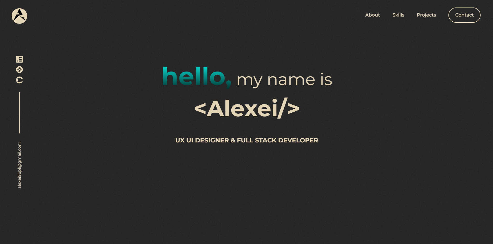
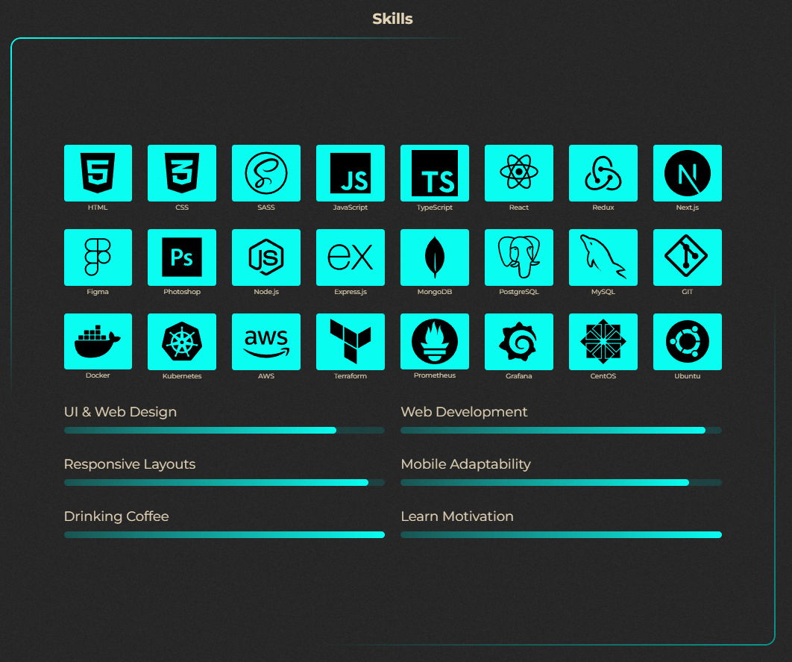
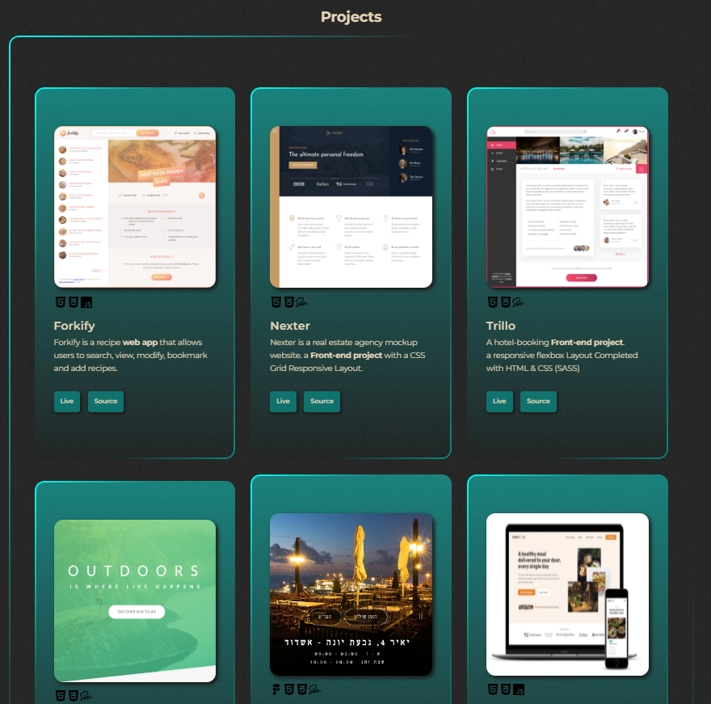
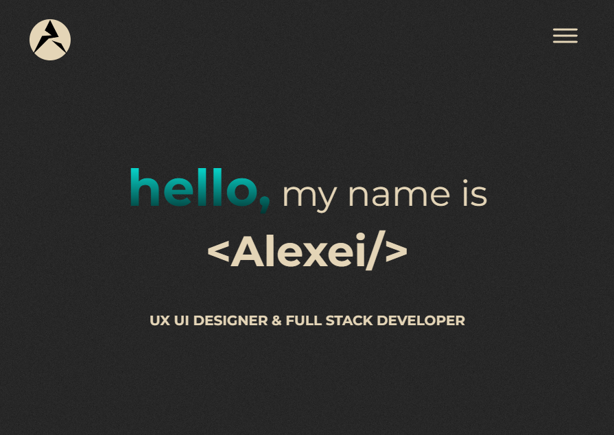

# Alexei Plokhikh — Frontend Developer Portfolio

A responsive, hand-built portfolio showcasing my **frontend development, responsive UI implementation, and web design skills**, alongside selected full-stack and DevOps projects.

The site is designed and developed from the ground up with a strong focus on translating visual ideas into clean, usable interfaces that adapt across desktop, tablet, and mobile layouts.

**Live Portfolio:** https://plokhikh.netlify.app/



## What this project demonstrates

### Responsive Frontend Development
- Responsive layouts designed for desktop, tablet, and mobile viewports
- Custom breakpoints and layout adaptations rather than a desktop-only interface
- Mobile navigation with a dedicated hamburger menu
- Responsive project grids, skills sections, typography, imagery, and contact layout
- Reusable Sass components and structured styling
- Attention to spacing, hierarchy, readability, and visual consistency across screen sizes



### UI / Web Design
The portfolio was both **designed and implemented by me**. It combines a dark visual theme, custom typography, gradients, project cards, skill visualization, navigation states, and responsive composition into one consistent interface.

My goal was not simply to make the desktop layout shrink on smaller screens, but to deliberately adapt the experience for the available space.

### Frontend Skills Highlighted
`HTML5` · `CSS3` · `Sass/SCSS` · `JavaScript` · `Responsive Design` · `Git`

The portfolio also presents experience with:

`TypeScript` · `React` · `Redux` · `Next.js` · `Node.js` · `Express` · `MongoDB` · `PostgreSQL` · `MySQL`

and my growing DevOps/cloud stack:

`Docker` · `Kubernetes` · `AWS` · `Terraform` · `Prometheus` · `Grafana` · `CentOS` · `Ubuntu`

## Selected Projects

The portfolio includes frontend projects demonstrating responsive layouts and UI implementation, as well as newer DevOps projects that take applications beyond development and into automated cloud deployment.



### DevOps NameGen
Production-style Node.js + MongoDB application deployed on AWS EKS with Terraform, Docker, GitHub Actions CI/CD, persistent storage, and monitoring.

### DevOps Pac-Man
Classic Pac-Man application containerized and deployed on AWS EKS with Terraform, Docker, GitHub Actions CI/CD, persistent MongoDB storage, and monitoring.

Additional projects include **Forkify, Nexter, Trillo, Natours**, and other frontend/full-stack work.

## Responsive Design

Responsiveness is a core part of this project rather than an afterthought.

The interface changes across viewport sizes to preserve usability and visual hierarchy. Desktop layouts make use of the available horizontal space, while smaller screens introduce layout changes such as simplified navigation, repositioned content, adjusted typography, and mobile-focused spacing.



This project reflects how I approach frontend work: **design for the screen the user actually has, not only the screen the design was created on.**

## Project Structure

```text
Portfolio/
├── icons/              # Technology and UI icons
├── img/
│   └── readme/         # README screenshots
├── sass/               # Sass source files
│   ├── abstracts/
│   ├── base/
│   ├── components/
│   ├── layout/
│   ├── pages/
│   └── main.scss
├── src/
│   ├── script.js       # Frontend interactions
│   └── styles.css      # Compiled CSS
├── index.html
├── cv.pdf
├── package.json
└── README.md
```

The Sass source is split into partials by responsibility, keeping the styling easier to maintain than a single monolithic stylesheet.

## Local Development

Install dependencies:

```bash
npm install
```

Watch and compile Sass while developing:

```bash
npm run watch:sass
```

Create the production stylesheet:

```bash
npm run build
```

## Deployment

The portfolio is deployed on **Netlify** and connected to this GitHub repository.

Every push to the `main` branch triggers a new build and deployment:

```text
Local development → GitHub → Netlify build → Live portfolio
```

Netlify runs the Sass production build automatically before publishing the site.

## About Me

I'm a developer with a background and strong interest in **UI/UX, frontend development, responsive interfaces, and full-stack web development**. I enjoy turning designs into functional interfaces and understanding the systems behind them — which has also led me into cloud infrastructure, containerization, CI/CD, and DevOps.

I'm particularly interested in opportunities where I can combine **frontend craftsmanship, responsive design, and broader engineering skills**.

## Contact

If you're a recruiter, engineering team, or company looking for a frontend/full-stack developer who cares about both **how an interface works and how it feels to use**, I'd be happy to connect.

**Portfolio:** https://plokhikh.netlify.app/  
**GitHub:** https://github.com/Alexplokhikh

---

*Designed and developed by Alexei Plokhikh.*
